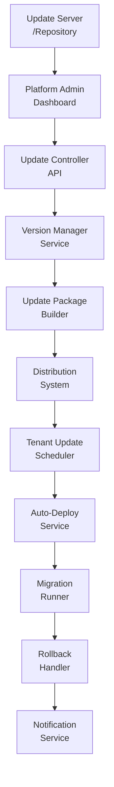
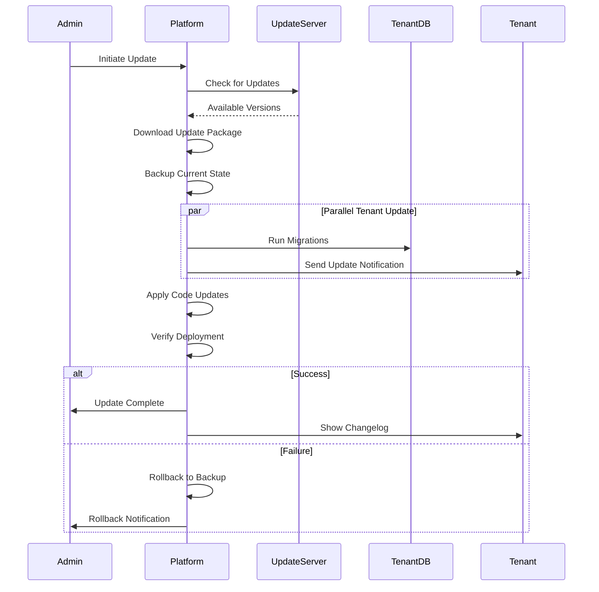

# OTA Platform Updates Architecture Plan

## Executive Summary

This document outlines the architecture for implementing automatic Over-The-Air (OTA) updates for the DCMS (Dental Clinic Management System) SaaS platform. The system will enable automated deployment of new Laravel application versions to all tenants with rollback capabilities and tenant notifications.

## Current Architecture Analysis

### Existing System Components
- **Platform**: Laravel 10.x + MongoDB multi-tenant SaaS
- **Database**: Central MongoDB (`mongodb_central`) for platform data, tenant-specific databases
- **Frontend**: Blade templates with Tailwind CSS, Alpine.js, Turbo
- **Admin Panel**: Located at `/admin` with settings management via [`PlatformSetting`](app/Models/PlatformSetting.php) model

### Key Observations
1. Platform settings stored in `platform_settings` collection (MongoDB)
2. Admin settings controller at [`Admin/SettingsController`](app/Http/Controllers/Admin/SettingsController.php)
3. No existing version tracking mechanism
4. Multi-tenant architecture with separate databases per tenant

---

## Architecture Design

### 1. Update System Components



### 2. Core Components

#### A. Platform Version Model
Create new model to track versions:
- **Table/Collection**: `platform_versions`
- **Fields**:
  - `version` (string): Semantic version (e.g., "1.2.0")
  - `release_type` (enum): 'major', 'minor', 'patch', 'hotfix'
  - `status` (enum): 'draft', 'testing', 'stable', 'deprecated'
  - `release_notes` (string): Changelog
  - `min_database_version` (string): Required DB schema version
  - `rollback_version` (string): Version to roll back to
  - `is_auto_deploy` (boolean): Auto-deploy to all tenants
  - `deployed_at` (datetime): When deployed
  - `created_by` (string): Admin user ID

#### B. Platform Settings Update
Extend existing [`PlatformSetting`](app/Models/PlatformSetting.php) model:
- Add fields: `current_version`, `min_supported_version`, `update_channel`, `auto_update_enabled`, `maintenance_mode`

#### C. Update Channels
| Channel | Description | Use Case |
|---------|-------------|----------|
| `stable` | Production-ready releases | All tenants |
| `beta` | Pre-release testing | Selected tenants |
| `alpha` | Early development | Internal testing |

---

## Database Schema

### New Migrations Required

```php
// Migration: 2026_03_10_000001_create_platform_versions_table.php
Schema::create('platform_versions', function (Blueprint $collection) {
    $collection->string('version')->unique();
    $collection->string('release_type'); // major, minor, patch, hotfix
    $collection->string('status'); // draft, testing, stable, deprecated
    $collection->text('release_notes');
    $collection->string('min_database_version');
    $collection->string('rollback_version')->nullable();
    $collection->boolean('is_auto_deploy')->default(false);
    $collection->timestamp('deployed_at')->nullable();
    $collection->string('created_by');
    $collection->timestamps();
});

// Migration: Add update fields to platform_settings
Schema::table('platform_settings', function (Blueprint $collection) {
    $collection->string('current_version')->default('1.0.0');
    $collection->string('min_supported_version')->default('1.0.0');
    $collection->string('update_channel')->default('stable'); // stable, beta, alpha
    $collection->boolean('auto_update_enabled')->default(true);
    $collection->boolean('maintenance_mode')->default(false);
});
```

---

## Implementation Plan

### Phase 1: Core Infrastructure

#### 1.1 Create Version Model
- [ ] Create `app/Models/PlatformVersion.php`
- [ ] Configure MongoDB connection
- [ ] Add validation rules

#### 1.2 Create Update Service
- [ ] Create `app/Services/PlatformUpdateService.php`
- Methods:
  - `checkForUpdates()`: Check update server/repository
  - `downloadUpdate()`: Download update package
  - `applyUpdate()`: Apply updates to platform
  - `rollback()`: Revert to previous version

#### 1.3 Create Update Controller
- [ ] Create `app/Http/Controllers/Admin/PlatformUpdateController.php`
- Routes:
  - `GET /admin/platform-updates` - List all versions
  - `POST /admin/platform-updates/check` - Check for updates
  - `POST /admin/platform-updates/deploy/{version}` - Deploy version
  - `POST /admin/platform-updates/rollback` - Rollback
  - `GET /admin/platform-updates/settings` - Update settings

### Phase 2: Auto-Deployment System

#### 2.1 Update Scheduler
- [ ] Create `app/Console/Commands/CheckPlatformUpdates.php`
- [ ] Schedule daily check for updates
- [ ] Implement tenant update queue

#### 2.2 Database Migration Runner
- [ ] Create `app/Services/MigrationRunner.php`
- [ ] Track migration status per tenant
- [ ] Handle migration failures gracefully

#### 2.3 Rollback System
- [ ] Store backup before each update
- [ ] Implement one-click rollback
- [ ] Track rollback history

### Phase 3: Admin Dashboard

#### 3.1 Update Management View
- [ ] Create `resources/views/admin/platform-updates/index.blade.php`
- Components:
  - Current version display
  - Available updates list
  - Update channel selector
  - Auto-update toggle
  - Rollback button

#### 3.2 Settings Panel
- [ ] Extend existing admin settings
- [ ] Add update preferences section

### Phase 4: Tenant Communication

#### 4.1 Notification System
- [ ] Create `app/Notifications/PlatformUpdateNotification.php`
- [ ] Email templates for:
  - Update available
  - Update in progress
  - Update completed
  - Update failed (with rollback info)

#### 4.2 In-App Notifications
- [ ] Add notification banner in tenant dashboard
- [ ] Show changelog on update completion

---

## Key Services Design

### PlatformUpdateService

```php
class PlatformUpdateService
{
    // Check for available updates from update server
    public function checkForUpdates(): UpdateInfo|null;
    
    // Download update package
    public function downloadUpdate(string $version): bool;
    
    // Apply update to platform
    public function applyUpdate(string $version): UpdateResult;
    
    // Rollback to previous version
    public function rollback(): RollbackResult;
    
    // Get current platform version
    public function getCurrentVersion(): string;
    
    // Update platform settings
    public function updateSettings(array $settings): bool;
}
```

### TenantUpdateService

```php
class TenantUpdateService
{
    // Check if tenant needs update
    public function needsUpdate(Tenant $tenant): bool;
    
    // Run tenant-specific migrations
    public function runTenantMigrations(Tenant $tenant): MigrationResult;
    
    // Update tenant configuration
    public function updateTenantConfig(Tenant $tenant): bool;
    
    // Verify tenant update success
    public function verifyUpdate(Tenant $tenant): bool;
}
```

---

## Update Flow



---

## Security Considerations

1. **Update Package Verification**
   - Validate package checksum (SHA-256)
   - Verify digital signature
   - Check package integrity before extraction

2. **Access Control**
   - Require `platform.update` permission
   - Log all update actions
   - Two-factor authentication for production deployments

3. **Network Security**
   - Use HTTPS for update server communication
   - Implement request signing
   - Rate limiting on update endpoints

---

## Rollback Strategy

### Pre-Update Backup
Before any update:
1. Create database snapshot
2. Backup configuration files
3. Store file checksums

### Rollback Triggers
- Migration failure
- Application crash post-update
- Admin-initiated rollback
- Critical error detection

### Rollback Process
1. Stop application
2. Restore file system from backup
3. Restore database from snapshot
4. Clear cache
5. Restart application

---

## API Endpoints Summary

| Method | Endpoint | Description |
|--------|----------|-------------|
| GET | `/api/v1/platform/version` | Get current version |
| GET | `/api/v1/platform/updates` | List available updates |
| POST | `/api/v1/platform/updates/check` | Check for new updates |
| POST | `/api/v1/platform/updates/deploy` | Deploy update |
| POST | `/api/v1/platform/rollback` | Rollback to previous version |
| GET | `/api/v1/platform/settings` | Get update settings |
| PUT | `/api/v1/platform/settings` | Update settings |

---

## Estimated Implementation Effort

| Phase | Description | Complexity |
|-------|-------------|------------|
| Phase 1 | Core Infrastructure | Medium |
| Phase 2 | Auto-Deployment | High |
| Phase 3 | Admin Dashboard | Medium |
| Phase 4 | Notifications | Low |

---

## Next Steps

1. **Review and Approve**: Review this architecture document
2. **Database Setup**: Create initial migration for version tracking
3. **Core Implementation**: Build PlatformVersion model and service
4. **Testing**: Test in staging environment
5. **Production Deploy**: Gradual rollout to tenants
